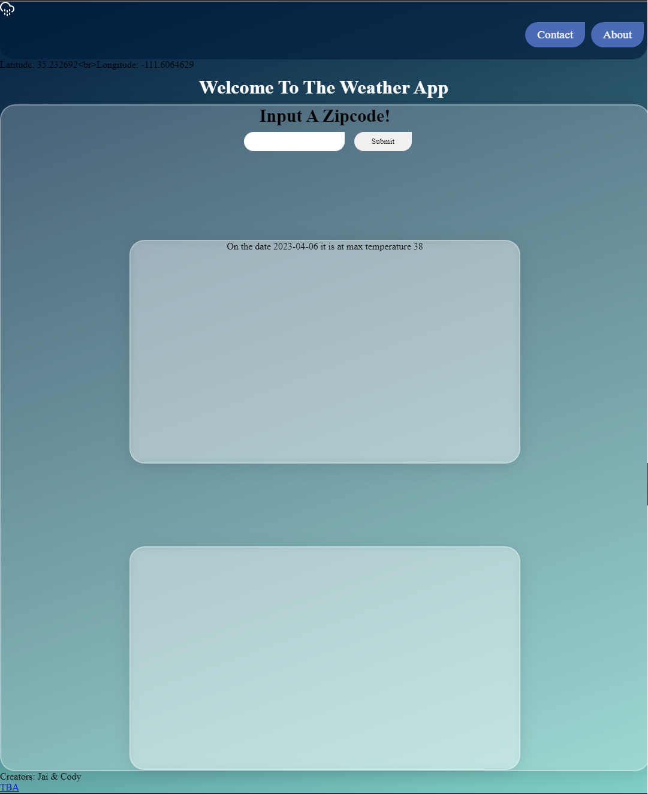

# Weatherboys

API PRoject for Phase-1 Flatiron School | Built By Jai | NOT FOR PROFIT = Educational ONLY

API Used: [Open-Meteo](https://open-meteo.com/)

Github site version of it: [Weather App](https://jstellmacher.github.io/Weatherboys/)

**Collaborative Version** ("With Cody"): [This Link](https://github.com/Chaospearl64/Weatherboys) with @Chaospearl64 or his link (https://github.com/Chaospearl64)

Article about the app - walkthrough on how to build something similar but not a true set-by-step: [Article Link](https://dev.to/jstellmacher/that-is-so-fetch-weather-api-webapp-1fo5)

Preview of Process

